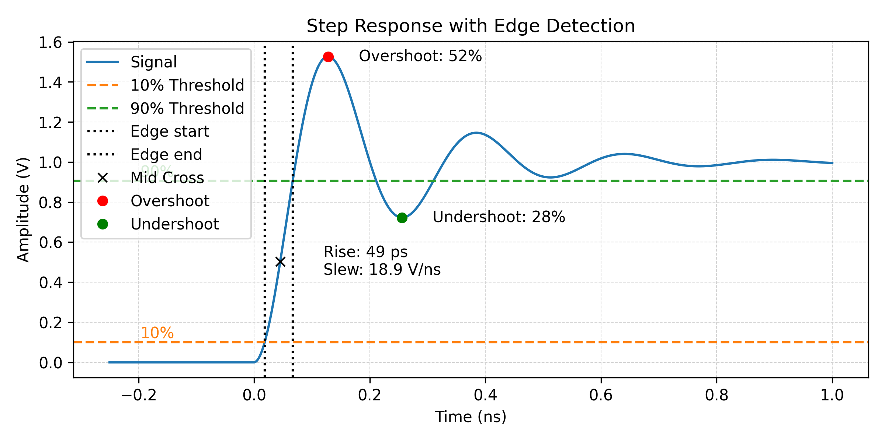

# pulse_transitions
This library implements a python version of the [Pulse and Transition Metrics function category](https://www.mathworks.com/help/signal/pulse-and-transition-metrics.html?s_tid=CRUX_lftnav) in Matlab.

## Example Use Case


For the full example see [examples/second_order_system.py](https://github.com/snhobbs/pulse_transitions/examples/second_order_system.py).

```python
import numpy as np
from scipy.signal import lsim
from scipy.signal import lti

from pulse_transitions import detect_edges
from pulse_transitions import detect_signal_levels
from pulse_transitions import get_edge_metrics


# Example: synthetic underdamped step response
def generate_step_response(t, damping=0.2, freq=10):
    # Second-order system parameters
    wn = freq          # Natural frequency (rad/s)
    zeta = damping        # Damping ratio

    # Transfer function: H(s) = wn^2 / (s^2 + 2*zeta*wn*s + wn^2)
    num = [wn**2]
    den = [1, 2*zeta*wn, wn**2]

    # Create the system
    system = lti(num, den)

    u = [0]*len(t[t<0]) + [1]*len(t[t>=0])
    t_shift = t-min(t)
    t_out, y_out, _ = lsim(system, U=u, T=t_shift)

    return t, y_out

# Generate data
t = np.linspace(-0.25, 1, 1000)
t_out, y = generate_step_response(t, freq=25/(max(t)))

threshold_fractions=(0.1, 0.9)

# Estimate levels (e.g. using histogram or endpoints)
levels = detect_signal_levels(x=t, y=y, method="histogram")
low, high = levels

# Detect edges
edge = detect_edges(t, y, levels=levels, thresholds=threshold_fractions)[0]

# Compute overshoot / undershoot
metrics = get_edge_metrics(x=t, y=y, thresholds=threshold_fractions, levels=levels)
```


## Installation
### pypi
```bash
pip install pulse_transitions
```

### GitHub Release
```bash
pip install https://github.com/snhobbs/pulse_transitions/archive/refs/tags/<TAGNAME>.zip
```

### From Source
```bash
git clone https://github.com/snhobbs/pulse_transitions/
pip install .
```


## Matpulse Functions

| Function                                                                    | Description                                                       |                  | Implemented?
| --------------------------------------------------------------------------- | ----------------------------------------------------------------- | ---------------- |---------
| [midcross](https://www.mathworks.com/help/signal/ref/midcross.html)         | Mid-reference level crossing for bilevel waveform                 |                  | ☑️
| [statelevels](https://www.mathworks.com/help/signal/ref/statelevels.html)   | State-level estimation for bilevel waveform with histogram method |                  | ☑️
| [falltime](https://www.mathworks.com/help/signal/ref/falltime.html)         | Fall time of negative-going bilevel waveform transitions          |                  | ☑️
| [overshoot](https://www.mathworks.com/help/signal/ref/overshoot.html)       | Overshoot metrics of bilevel waveform transitions                 |                  | ☑️
| [risetime](https://www.mathworks.com/help/signal/ref/risetime.html)         | Rise time of positive-going bilevel waveform transitions          |                  | ☑️
| [settlingtime](https://www.mathworks.com/help/signal/ref/settlingtime.html) | Settling time for bilevel waveform                                |                  | ☑️
| [slewrate](https://www.mathworks.com/help/signal/ref/slewrate.html)         | Slew rate of bilevel waveform                                     |                  | ☑️
| [undershoot](https://www.mathworks.com/help/signal/ref/undershoot.html)     | Undershoot metrics of bilevel waveform transitions                |                  | ☑️
| [dutycycle](https://www.mathworks.com/help/signal/ref/dutycycle.html)       | Duty cycle of pulse waveform                                      |                  | ❌
| [pulseperiod](https://www.mathworks.com/help/signal/ref/pulseperiod.html)   | Period of bilevel pulse                                           |                  | ❌
| [pulsesep](https://www.mathworks.com/help/signal/ref/pulsesep.html)         | Separation between bilevel waveform pulses                        |                  | ❌
| [pulsewidth](https://www.mathworks.com/help/signal/ref/pulsewidth.html)     | Bilevel waveform pulse width                                      |                  | ❌


## Background & Resources
### HP Journal
There's an excellent description of the algorithms used by HP [here](https://hparchive.com/Journals/HPJ-1996-12.pdf).

### Control Library
+ [GitHub](https://github.com/python-control/python-control)
+ [Docs](https://python-control.readthedocs.io)
